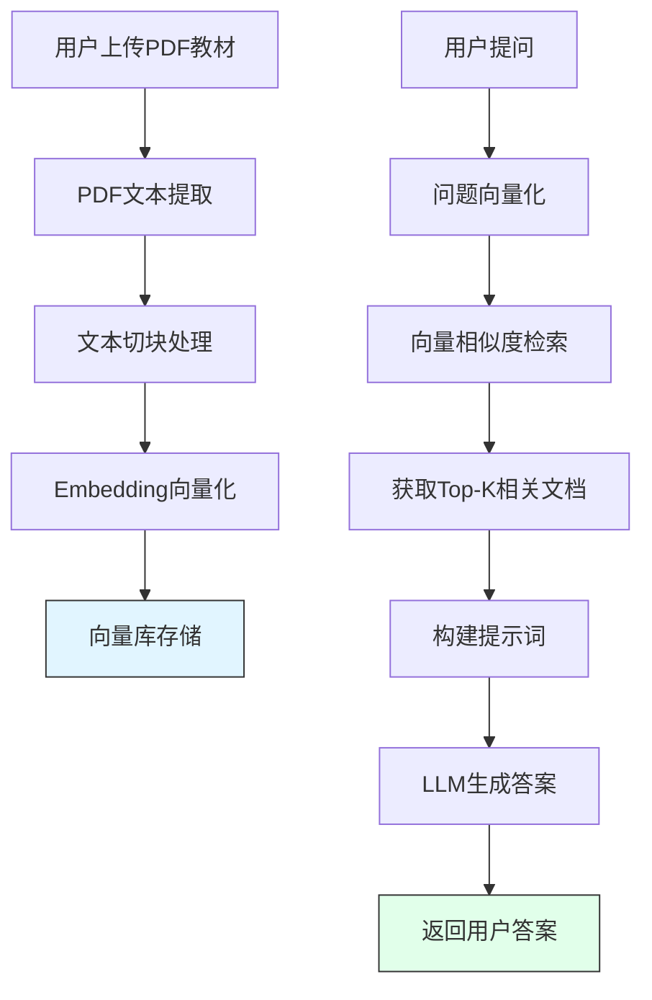

# 一建机电教材RAG问答系统 - MVP说明文档

## 📋 项目概述

这是一个基于本地大模型的一建机电考试教材检索与问答系统，能够基于上传的PDF教材内容提供精准的问答服务，完全在本地运行，保护数据隐私。

## 🛠 技术环境

### 系统要求
- **操作系统**: Windows 10/11
- **处理器**: Intel Core i5-11500T 或同等性能
- **内存**: 12GB 或更高
- **显卡**: Intel UHD 750 或其他集成显卡（无需独立显卡）
- **磁盘空间**: 至少 10GB 可用空间

### 软件环境
- **Python**: 3.9+
- **Ollama**: 本地大模型部署框架
- **大语言模型**: 
  - LLM: qwen2.5:7b
  - Embedding: mxbai-embed-large
- **浏览器**: Chrome, Edge 或 Firefox 等现代浏览器

## 🏗 技术架构

### 核心组件

| 组件 | 技术选型 | 说明 |
|------|----------|------|
| **界面** | Tkinter | Python原生GUI框架，轻量高效 |
| **向量数据库** | 自定义简单向量库 | 避免了ChromaDB的HNSW索引问题，使用NumPy实现向量检索 |
| **Embedding模型** | mxbai-embed-large | 768维向量表示，支持中英文 |
| **LLM** | qwen2.5:7b | 通义千问最新模型，中文理解能力强 |
| **PDF解析** | pdfplumber | 高效提取PDF文本内容 |
| **文本处理** | LangChain RecursiveCharacterTextSplitter | 智能文本切块 |

### 工作原理



### RAG技术原理

**RAG (Retrieval-Augmented Generation)** 即检索增强生成，是解决大模型知识更新和幻觉问题的关键技术：

1. **文本切割与Embedding**
   - 将PDF教材切分为400字符的小片段
   - 每个片段经过mxbai-embed-large模型生成向量表示
   - 向量数据持久化保存到本地

2. **语义检索**
   - 将用户问题同样转换为向量表示
   - 计算问题向量与所有文档向量的余弦相似度
   - 对检索结果进行关键词匹配增强
   - 返回Top-3最相关文档

3. **提示词工程**
   - 严格要求模型仅根据教材内容回答
   - 禁止使用通用知识
   - 要求输出清晰美观的格式

4. **生成回答**
   - qwen2.5:7b模型根据上下文生成专业答案
   - 温度参数设置为0保证答案确定性

## 📁 项目文件结构

```
一建机电RAG/
├── data/
│   ├── chroma_db/              # ChromaDB旧向量库（已停用）
│   ├── uploads/                # 用户上传的PDF教材
│   │   └── 2026冬阳一建机电PDF教材(1).pdf
│   └── vector_db_simple/       # 当前使用的简单向量库
│       └── 2026冬阳一建机电PDF教材(1)/
│           ├── vectors.pkl     # 向量数据
│           └── metadata.json   # 元数据
├── desktop_app.py              # 主程序（最新版本）
├── requirements.txt            # Python依赖
├── MVP.MD                      # 本文档
└── *.py                        # 各种测试和调试脚本
```

## 🚀 快速开始

### 1. 环境配置

#### 安装Python依赖
```bash
pip install -r requirements.txt
```

#### 安装Ollama
1. 访问 [Ollama官网](https://ollama.ai/) 下载并安装Windows版本
2. 启动Ollama服务

#### 下载所需模型
```bash
ollama pull qwen2.5:7b
ollama pull mxbai-embed-large
```

### 2. 运行程序

#### 方式1：使用启动脚本
```bash
快速启动.bat
```

#### 方式2：直接运行Python
```bash
python desktop_app.py
```

### 3. 使用程序

1. **上传教材**
   - 点击"选择PDF文件"按钮
   - 选择本地的一建机电PDF教材

2. **开始问答**
   - 在输入框中输入问题
   - 点击"提问"按钮
   - 等待AI生成答案

3. **示例问题**
   - "工业管道的基本识别色有哪些？"
   - "焊接方法有几种？"
   - "机电安装需要注意什么？"

## 🔧 关键技术实现

### 向量库存储设计

```python
class SimpleVectorStore:
    def __init__(self, persist_dir, embeddings):
        # 初始化向量存储
        self.vectors = []  # NumPy数组存储向量
        self.documents = []  # 存储文档内容
    
    def similarity_search(self, query, k=4):
        # 余弦相似度计算
        # 关键词匹配增强
        # 返回Top-K相关文档
```

### 增强中文检索策略

```python
def extract_chinese_tokens(text):
    """提取中文n-gram进行关键词匹配"""
    tokens = set()
    for match in re.finditer(r'[\u4e00-\u9fff]+', text):
        chunk = match.group()
        for i in range(len(chunk)):
            for j in range(i+2, min(i+5, len(chunk)+1)):
                tokens.add(chunk[i:j])
    return tokens
```

**混合检索策略**：
1. 提取中文n-gram关键词
2. 统计关键词匹配数量
3. 对关键词匹配的文档进行分数加权
4. 结合向量相似度进行排序

### 严格提示词工程

```python
prompt_template = """你是一个专业的一建机电考试辅导老师。请根据以下教材内容回答问题。

【重要要求】
1. 答案必须100%基于提供的教材参考资料，不要使用任何教材以外的知识
2. 如果教材中没有相关内容，就直接说明"教材中没有找到相关内容"
3. 不要使用GB标准号或其他通用知识，只引用教材原文
4. 回答格式要清晰、美观，使用列表形式呈现

参考内容:
{context}

问题:
{question}

请直接回答问题。
"""
```

## 📊 性能优化

### 向量库缓存机制

- 第一次处理教材时：解析 → 切块 → 向量化 → 保存到磁盘
- 后续使用：直接从磁盘加载向量库，无需重新处理
- 缓存位置：`data/vector_db_simple/{pdf文件名}/`

### 文本切块参数

- **Chunk大小**: 400字符
- **重叠**: 50字符
- 保证上下文完整性，提高检索准确率

### 检索参数

- **Top-K**: 3个相关文档
- **上下文限制**: LLM接收800字符以内的内容
- **输出温度**: 0（确定性输出）

## 🐛 问题解决记录

### 已修复的问题

| 问题 | 原因 | 解决方案 |
|------|------|----------|
| ChromaDB HNSW索引损坏 | ChromaDB的HNSW索引文件不完整 | 开发自定义简单向量库 |
| Embedding模型对中文处理不精准 | mxbai-embed-large对长中文理解有限 | 增加关键词匹配增强检索 |
| AI使用通用知识而非教材 | 提示词不够严格 | 强化"仅根据教材回答"要求 |

### 常见错误排查

**Ollama服务未启动**
```
# 检查Ollama是否正在运行
# Windows: 任务管理器 → 查找ollama.exe
# 解决方案: 重新启动Ollama应用
```

**模型不存在**
```
# 运行诊断工具
python 诊断工具.py
# 根据提示下载所需模型
ollama pull 模型名称
```

**向量库损坏**
```
# 删除向量库目录重新构建
Remove-Item -Path "data/vector_db_simple/{pdf名}" -Recurse -Force
# 重新运行程序
```

## 📈 未来改进方向

### 短期优化
- [ ] 进一步优化中文检索准确率
- [ ] 添加章节定位功能，告诉用户答案来自哪一页
- [ ] 优化模型输出格式，使其更清晰
- [ ] 添加历史对话记录功能

### 中期功能
- [ ] 支持多个教材文件同时加载
- [ ] 向量库增量更新
- [ ] 支持多种文件格式（Word, TXT）
- [ ] 添加笔记和标注功能

### 长期规划
- [ ] 打包为Windows可执行程序（PyInstaller）
- [ ] 支持分布式部署
- [ ] 集成模型热切换功能
- [ ] 添加用户反馈系统

## 🔗 相关资源

- **Ollama官网**: https://ollama.ai/
- **LangChain文档**: https://python.langchain.com/
- **Qwen2.5模型**: https://github.com/QwenLM/Qwen2.5
- **mxbai-embed-large**: https://huggingface.co/mixedbread-ai/mxbai-embed-large-v1

## 📄 许可证说明

本项目仅供个人学习和研究使用。

---

**项目创建日期**: 2026年5月  
**当前版本**: MVP v1.0  
**最后更新**: 2026年5月17日
