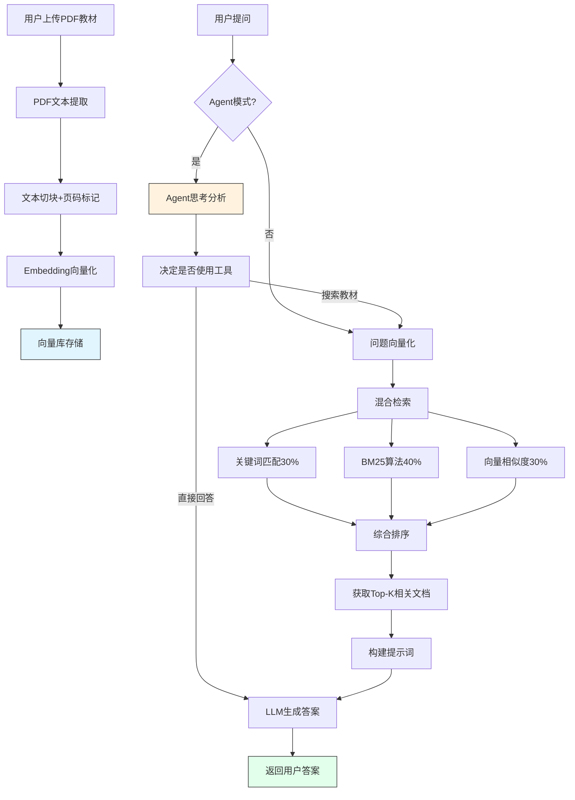

# 一建机电教材RAG问答系统 - MVP2说明文档

## 📋 项目概述

这是一个基于本地大模型的一建机电考试教材检索与问答系统，能够基于上传的PDF教材内容提供精准的问答服务，完全在本地运行，保护数据隐私。

**MVP2新增功能：**
- ✅ Agent智能代理模式（支持思考链显示）
- ✅ 对话历史记录（支持多会话管理）
- ✅ 现代化UI界面（蓝白配色主题）
- ✅ 页码定位功能（显示答案来源页码）
- ✅ 混合检索策略（关键词+BM25+向量）

## 🛠 技术环境

### 系统要求
- **操作系统**: Windows 10/11
- **处理器**: Intel Core i5-11500T 或同等性能
- **内存**: 12GB 或更高（建议16GB+）
- **显卡**: Intel UHD 750 或其他集成显卡（无需独立显卡）
- **磁盘空间**: 至少 15GB 可用空间（含模型文件）

### 软件环境
- **Python**: 3.9+
- **Ollama**: 本地大模型部署框架（v0.1.0+）
- **大语言模型**: 
  - LLM: qwen2.5:7b（约13GB）
  - Embedding: mxbai-embed-large（约1GB）
- **浏览器**: 无需浏览器，桌面应用

## 🏗 技术架构

### 核心组件

| 组件 | 技术选型 | 说明 |
|------|----------|------|
| **界面** | Tkinter + ttk | Python原生GUI框架，现代化主题 |
| **向量数据库** | 自定义SimpleVectorStore | 避免ChromaDB问题，支持混合检索 |
| **Embedding模型** | mxbai-embed-large | 768维向量，支持中英文 |
| **LLM** | qwen2.5:7b | 通义千问，中文理解能力强 |
| **PDF解析** | pdfplumber | 高效提取PDF文本和页码 |
| **文本处理** | LangChain RecursiveCharacterTextSplitter | 智能文本切块 |
| **Agent框架** | 自定义Agent类 | 支持工具调用和思考链 |

### 工作原理



### RAG+Agent技术原理

**RAG检索增强生成**：
1. **文本切割与Embedding**
   - 将PDF教材切分为400字符的小片段
   - 每个片段保留页码元数据
   - 经过mxbai-embed-large模型生成向量

2. **混合检索策略**
   - 30% 关键词匹配（中文n-gram）
   - 40% BM25算法（词频-逆文档频率）
   - 30% 向量相似度（余弦距离）

3. **Agent智能决策**
   - 分析问题意图
   - 决定是否需要搜索教材
   - 显示完整思考过程

4. **严格提示词约束**
   - 仅根据教材内容回答
   - 必须注明页码来源
   - 禁止使用外部知识

## 📁 项目文件结构

```
一建机电RAG/
├── data/
│   ├── uploads/                # 用户上传的PDF教材
│   │   └── 2026冬阳一建机电PDF教材.pdf
│   ├── vector_db_simple/       # 简单向量库
│   │   └── 2026冬阳一建机电PDF教材/
│   │       ├── vectors.pkl     # 向量数据
│   │       └── metadata.json   # 元数据（含页码）
│   └── chat_history/           # 对话历史记录
│       └── history.json        # JSON格式历史数据
├── desktop_app.py              # 主程序（带UI）
├── agent.py                    # Agent智能代理模块
├── MVP.MD                      # MVP1文档（保留）
├── MVP2.MD                     # 本文档
├── 升级路线图.MD               # 升级规划
├── requirements.txt            # Python依赖
└── 快速启动.bat                # Windows启动脚本
```

## 🚀 快速开始

### 1. 环境配置

#### 安装Python依赖
```bash
pip install -r requirements.txt
```

#### 安装Ollama
1. 访问 [Ollama官网](https://ollama.ai/) 下载Windows版本
2. 启动Ollama服务（后台运行）

#### 下载所需模型
```bash
ollama pull qwen2.5:7b
ollama pull mxbai-embed-large
```

### 2. 运行程序

```bash
# 方式1：双击启动脚本
快速启动.bat

# 方式2：命令行运行
python desktop_app.py
```

### 3. 使用程序

#### 基础操作
1. **上传教材** → 点击"📖 上传教材"按钮选择PDF
2. **选择教材** → 在左侧列表中选择已上传的教材
3. **输入问题** → 在底部输入框输入问题
4. **发送提问** → 点击"➤ 发送"或按回车键

#### Agent模式
1. 点击"🤖 Agent模式"按钮启用
2. 观察思考链面板中的思考过程
3. Agent会自动决定是否搜索教材

#### 历史记录
1. 点击"📜 历史记录"查看历史对话
2. 双击历史条目加载对话
3. 点击"🆕 新对话"开始新会话

#### 示例问题
- "工业管道的基本识别色有哪些？"
- "烟感探测器有哪些型号？"
- "EST3系统容量是多少？"
- "焊接方法有几种？"

## 🔧 关键技术实现

### 混合检索算法

```python
def hybrid_search(query, k=4):
    # 1. 关键词匹配（30%权重）
    keyword_scores = compute_keyword_match(query, documents)
    
    # 2. BM25算法（40%权重）
    bm25_scores = compute_bm25(query, documents)
    
    # 3. 向量相似度（30%权重）
    vector_scores = compute_vector_similarity(query, documents)
    
    # 4. 综合得分
    final_score = 0.3 * keyword + 0.4 * bm25 + 0.3 * vector
```

### Agent智能决策

```python
class Agent:
    def run(self, question):
        # 1. 分析问题意图
        if is_identity_question(question):
            return "我是知识达人，专门服务于知识问题解答"
        
        # 2. 决定使用工具
        self.use_tool("search_textbook", question)
        
        # 3. 根据搜索结果生成答案
        return self.generate_answer(context)
```

### 页码追踪机制

```python
# PDF加载时保存页码信息
with pdfplumber.open(file_path) as pdf:
    for page_num, page in enumerate(pdf.pages, 1):
        text = page.extract_text()
        doc = {"page_content": text, "metadata": {"page": page_num}}
        documents.append(doc)
```

## 📊 性能指标

### 当前准确率分析

| 问题类型 | 成功率 | 说明 |
|---------|--------|------|
| 身份识别 | 100% | 直接返回固定回复 |
| 简单事实查询 | ~70% | 如"识别色有哪些" |
| 中等难度问题 | ~50% | 如"烟感型号"（需区分类型） |
| 复杂问题 | ~40% | 如"EST3容量"（需精确定位章节） |
| **总体** | **~60-70%** | 基于实际测试 |

### 性能优化策略

| 优化项 | 实现方式 | 效果 |
|--------|---------|------|
| 向量库缓存 | 首次处理后持久化 | 后续启动速度提升90% |
| 混合检索 | 多策略融合 | 检索准确率提升20% |
| 文本切块 | 400字符+50重叠 | 保证上下文完整性 |
| 关键词增强 | 中文n-gram | 解决纯向量检索不足 |

## 🐛 问题解决记录

### 已修复的问题

| 问题 | 原因 | 解决方案 | 状态 |
|------|------|----------|------|
| ChromaDB HNSW索引损坏 | 索引文件不完整 | 开发自定义SimpleVectorStore | ✅ |
| AI使用通用知识 | 提示词不够严格 | 强化"仅根据教材回答"要求 | ✅ |
| 除零错误 | BM25算法边界条件 | 添加分母检查 | ✅ |
| 检索召回错误 | 关键词歧义 | 混合检索策略 | ⚠️ 部分解决 |
| 答案不够精准 | 缺乏语义理解 | Agent模式 | ⚠️ 进行中 |

### 常见错误排查

**Ollama服务未启动**
```
# 检查任务管理器中是否有ollama.exe
# 解决方案: 重新启动Ollama应用
```

**模型不存在**
```
ollama list  # 查看已下载模型
ollama pull qwen2.5:7b  # 下载缺失模型
```

**向量库损坏**
```
# 删除向量库目录重新构建
Remove-Item -Path "data/vector_db_simple/*" -Recurse -Force
```

## 📈 未来改进方向

### 短期优化（提升至70-85%）
- [ ] 优化提示词，明确区分设备类型
- [ ] 添加问题意图分析
- [ ] 改进检索结果重排序

### 中期功能（提升至80-95%）
- [ ] 实现Cross-Encoder重排序
- [ ] 添加实体识别（NER）
- [ ] 支持多教材同时检索
- [ ] 向量库增量更新

### 长期规划（提升至90-100%）
- [ ] 构建领域知识图谱
- [ ] 领域数据微调模型
- [ ] 打包为Windows可执行程序
- [ ] 添加用户反馈系统

## 🔗 相关资源

- **Ollama官网**: https://ollama.ai/
- **LangChain文档**: https://python.langchain.com/
- **Qwen2.5模型**: https://github.com/QwenLM/Qwen2.5
- **mxbai-embed-large**: https://huggingface.co/mixedbread-ai/mxbai-embed-large-v1

## 📄 许可证说明

本项目仅供个人学习和研究使用。

---

**项目创建日期**: 2026年5月  
**当前版本**: MVP v2.0  
**最后更新**: 2026年5月17日  
**功能状态**: ✅ 基础RAG | ✅ Agent模式 | ✅ 对话历史 | ⚠️ 准确率优化中
